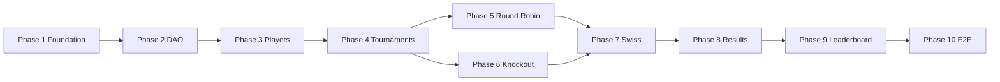

# Phase-Wise Development Plan

## Chess Tournament Management System

| Document | 10-Phase Implementation Plan |
|----------|------------------------------|
| Version | 1.0 |
| References | [SRS.md](./SRS.md), [SDD.md](./SDD.md) |
| Credit balancing | Each phase targets **~same executor effort**: 8–12 implementation tasks, 4–8 new/changed source files, 2–5 automated tests, 1 integration checkpoint |

---

## How to Use This Plan

1. Execute phases **in order** (1 → 10). Do not skip prerequisites.
2. At phase end, run the **Phase Exit Checklist** before starting the next phase.
3. If a task fails, fix within the same phase; do not carry broken builds forward.
4. **Equal AI credits** means each phase is scoped to one focused agent session: one vertical slice of backend or UI, not “everything left.”
5. Commit after each phase only if the user requested git workflow (optional).

---

## Phase Overview

| Phase | Title | Primary output |
|-------|--------|----------------|
| 1 | Foundation & database bootstrap | Maven project, Flyway, DB connectivity, empty JavaFX shell |
| 2 | Domain model & data access layer | All entities, JDBC DAOs, UnitOfWork |
| 3 | Global player registry | PlayerService + player UI screens |
| 4 | Tournaments & enrollment | Tournament lifecycle, enrollment, list/dashboard skeleton |
| 5 | Round Robin pairings | Schedule generator, RR strategy, pairing publish API |
| 6 | Knockout pairings & elimination | Bracket, byes, loser marking hooks |
| 7 | Swiss/Dutch pairings | First round + subsequent rounds, rematch flag |
| 8 | Results, scoring & Elo ratings | ResultService.completeRound transaction |
| 9 | Leaderboards & qualification | Standings, tie-breaks, finalize |
| 10 | End-to-end UI & release hardening | Wire all screens, demo data, README, E2E checklist |

---

## Global Conventions (All Phases)

- **Base package**: `com.chess.tournament`
- **Java**: 17 (`maven.compiler.release=17`)
- **Do not** put SQL in UI or pairing logic in DAOs.
- **Tests**: `src/test/java` mirroring main package.
- **Logging**: SLF4J; no `System.out` except temporary debug removed before phase exit.

---

# Phase 1 — Foundation & Database Bootstrap

## Goal

A compilable Maven project that connects to PostgreSQL, applies schema migration `V1`, and opens a minimal JavaFX window with a “Connected to database” indicator.

## Prerequisites

- JDK 17 installed (`java -version`).
- Maven 3.8+ (`mvn -version`).
- PostgreSQL running; empty database `chess_tournament` created.
- Copy `config/application.properties.example` → `config/application.properties` with real credentials (gitignore `config/application.properties`).

## Deliverables

| Artifact | Path |
|----------|------|
| POM with dependencies | `pom.xml` |
| Example config | `config/application.properties.example` |
| Gitignore | `.gitignore` |
| Initial schema | `src/main/resources/db/migration/V1__initial_schema.sql` (from SDD §4.2) |
| DB config loader | `src/main/java/.../config/DatabaseConfig.java` |
| App entry | `src/main/java/.../bootstrap/ChessTournamentApp.java` |
| Composition root stub | `src/main/java/.../bootstrap/AppContext.java` |
| Main FXML | `src/main/resources/fxml/main.fxml` |
| Main controller stub | `src/main/java/.../ui/MainController.java` |
| Logback | `src/main/resources/logback.xml` |
| README setup section | `README.md` |

## Task List (execute in order)

1. **Create Maven project** with groupId `com.chess.tournament`, artifactId `chess-tournament-manager`, version `1.0.0-SNAPSHOT`.
2. **Add dependencies** (versions pinned in POM):
   - PostgreSQL JDBC driver
   - HikariCP
   - Flyway Core
   - JavaFX controls + FXML (OpenJFX 21)
   - SLF4J API + Logback
   - JUnit 5, Mockito (test scope)
3. **Configure plugins**: compiler release 17; `javafx-maven-plugin` with mainClass `com.chess.tournament.bootstrap.ChessTournamentApp`.
4. **Add Flyway** migration file exactly as SDD §4.2 (copy DDL verbatim).
5. **Implement `DatabaseConfig`**: read `CTMS_DB_*` env vars, fallback to `config/application.properties` path relative to working directory.
6. **Implement `AppContext`**: create `HikariDataSource`, run `Flyway.configure().dataSource(...).load().migrate()`, expose `DataSource getDataSource()`.
7. **Implement `ChessTournamentApp`**: extends `Application`, load `main.fxml`, show 1024×768 window, title “Chess Tournament Manager”.
8. **Implement `MainController`**: on initialize, run `SELECT 1` via JDBC and set label text success/failure.
9. **Add `.gitignore`**: `target/`, `.idea/`, `config/application.properties`, `*.log`.
10. **Write README.md** sections: Prerequisites, Database setup, Configuration, `mvn flyway:migrate`, `mvn javafx:run`.

## Tests (Phase 1)

- `DatabaseConfigTest`: load properties from test resource file (use H2 only if needed for unit test; **integration test optional** this phase).
- Manual: wrong password shows error label on main screen.

## Phase Exit Checklist

- [ ] `mvn -q compile` succeeds
- [ ] `mvn flyway:migrate` creates all tables
- [ ] `mvn javafx:run` opens window with DB success message
- [ ] No credentials in git

## Out of Scope

- DAOs, services, business logic.

---

# Phase 2 — Domain Model & Data Access Layer

## Goal

Complete domain types, JDBC DAO implementations for all tables, and transactional `UnitOfWork` — verified by integration tests against PostgreSQL (Testcontainers) or local DB.

## Prerequisites

- Phase 1 complete.

## Deliverables

| Component | Files |
|-----------|--------|
| Enums | `domain/enums/*.java` (all enums from SDD §5.1) |
| Entities | `domain/Player.java`, `Tournament.java`, `TournamentPlayer.java`, `Round.java`, `Game.java` |
| Exceptions | `exception/DomainException.java`, `ValidationException.java`, `NotFoundException.java`, `DataAccessException.java` |
| UnitOfWork | `dao/UnitOfWork.java`, `dao/JdbcUnitOfWork.java` |
| DAOs | `PlayerDao`, `TournamentDao`, `TournamentPlayerDao`, `RoundDao`, `GameDao` + `Jdbc*` impls |
| Test support | `src/test/resources/application-test.properties` |

## Task List

1. Create **immutable or bean-style** domain classes matching SDD columns; use `BigDecimal` for points/scores.
2. Implement **PlayerDao**: insert, findById, findAll, update (touch `updated_at`).
3. Implement **TournamentDao**: insert, findById, findByStatus, update status fields.
4. Implement **TournamentPlayerDao**: insert, findByTournament, updateStats, updateQualification, delete enrollment.
5. Implement **RoundDao**: insert, findByTournamentAndNumber, findByTournament, updateStatus.
6. Implement **GameDao**: insertBatch, findByRound, updateResult, findPreviousPairings (query all games in tournament joins).
7. Implement **JdbcUnitOfWork** with commit/rollback.
8. Write **DAO integration test** class `PlayerDaoIntegrationTest` (Testcontainers PostgreSQL recommended): insert player, read back.
9. Duplicate pattern for `TournamentDaoIntegrationTest` (create tournament row).
10. Document in README how to run tests: `mvn test`.

## Tests (Phase 2)

- Minimum **4 integration tests** across DAOs (insert/find/update).
- `findPreviousPairings` test: two games in two rounds → set contains both unordered pairs.

## Phase Exit Checklist

- [ ] All DAO methods in SDD §6.3 implemented
- [ ] `mvn test` passes
- [ ] No UI changes required beyond compile

## Out of Scope

- Services, pairing, JavaFX forms.

---

# Phase 3 — Global Player Registry

## Goal

Host can create, edit, and list players globally; data persists in PostgreSQL; JavaFX player management screen fully functional.

## Prerequisites

- Phase 2 complete.

## Deliverables

| Item | Path |
|------|------|
| PlayerService | `service/PlayerService.java` |
| DTO/validation | use `ValidationException` with message keys or plain strings |
| FXML | `resources/fxml/player_list.fxml`, `player_form.fxml` (or single pane) |
| Controllers | `ui/player/PlayerListController.java`, `PlayerFormController.java` |
| Navigation | Wire from `MainController` menu “Players” |

## Task List

1. **PlayerService.create**: validate name (trim, non-empty), default rating 1500, persist via DAO.
2. **PlayerService.update**: allow edit name, age, country, global_rating; reject if invalid age.
3. **PlayerService.list**: return active players sorted by name.
4. **PlayerService.deactivate** (optional Should): set `active=false`.
5. **Extend AppContext**: register `PlayerService` bean.
6. **Build PlayerListController**: TableView columns — ID, Name, Age, Country, Rating; buttons Add, Edit, Refresh.
7. **Build form dialog/panel** for add/edit; on save call service, refresh table on FX thread after `Task`.
8. **Error handling**: show Alert on ValidationException.
9. **Unit tests**: `PlayerServiceTest` with mocked DAO (create validation, default rating).
10. **Manual test script** in phase notes: add 8 players with varied ratings.

## Tests (Phase 3)

- 3+ unit tests for PlayerService.
- Manual UI checklist documented in commit message or test plan file `docs/manual/phase3-players.md` (create brief file).

## Phase Exit Checklist

- [ ] CRUD works via UI
- [ ] Restart app — players still listed
- [ ] SRS FR-PLR-001..003 satisfied

## Out of Scope

- Tournament enrollment.

---

# Phase 4 — Tournaments & Enrollment

## Goal

Create tournaments (all three types), view tournament list, enroll/remove players in DRAFT, start tournament (ACTIVE + round 1 row), tournament dashboard skeleton with state flags.

## Prerequisites

- Phase 3 complete (players exist for enrollment tests).

## Deliverables

| Item | Path |
|------|------|
| Commands/DTOs | `service/dto/CreateTournamentCommand.java` |
| Validators | `service/validation/TournamentValidator.java`, format-specific validators |
| Services | `TournamentService.java`, `EnrollmentService.java` |
| FXML | `tournament_list.fxml`, `tournament_create.fxml`, `tournament_dashboard.fxml`, `enrollment.fxml` |
| Controllers | matching `ui/tournament/*` |
| ViewModel | `ui/tournament/TournamentViewModel.java` (can* flags stubbed with real rules) |

## Task List

1. **CreateTournamentCommand** fields: name, type, roundsPlanned, qualifiersCount, swissFirstRoundMethod (required only for SWISS).
2. **TournamentValidator**: common field validation; delegate to `RoundRobinValidator`, `KnockoutValidator`, `SwissValidator` for round counts:
   - RR: expected rounds = N-1 if even N else N (document: use enrollment count at start time).
   - KO: rounds = ceil(log2(N)) with byes allowed at start.
   - Swiss: roundsPlanned >= 1 (no upper bound v1).
3. **TournamentService.create** → DRAFT.
4. **TournamentService.start**:
   - Validate min players: RR≥3, KO≥2, SWISS≥2 (warn SWISS if <4 in UI).
   - Set ACTIVE, `started_at=now()`, insert `round` row 1 with PENDING_PAIRINGS.
5. **EnrollmentService.enroll/unenroll** with BR-ENR-001 and lock when round 1 not PENDING_PAIRINGS.
6. On enroll: set start_rating and current_rating from global_rating.
7. **UI tournament list**: create button, table with name/type/status/rounds.
8. **UI create form**: combo type, spinners for rounds/qualifiers, Swiss method visible when SWISS selected.
9. **Dashboard**: show config, enrolled count, buttons (disabled until valid): Start, Manage Enrollment, Generate Pairings (no-op Phase 5), Leaderboard (placeholder).
10. **Integration test**: create tournament, enroll 4 players, start → round 1 exists.

## Tests (Phase 4)

- Unit tests for each validator with edge cases (RR wrong round count fails).
- Integration test enrollment uniqueness (same player twice fails).

## Phase Exit Checklist

- [ ] All three tournament types creatable
- [ ] Start blocked when player count too low
- [ ] Enrollment locked after start + simulating published pairings (manually set round status in DB test)

## Out of Scope

- Actual pairing generation.

---

# Phase 5 — Round Robin Pairings

## Goal

Generate and publish Round Robin pairings for every round in the schedule; display pairings via service API (UI table optional minimal); no result entry yet.

## Prerequisites

- Phase 4 complete; at least one RR tournament started with 4–6 players enrolled.

## Deliverables

| Item | Path |
|------|------|
| Schedule generator | `service/pairing/RoundRobinScheduleGenerator.java` |
| Strategy | `service/pairing/RoundRobinPairingStrategy.java` |
| Factory | `service/pairing/PairingStrategyFactory.java` |
| Context record | `service/pairing/PairingContext.java`, `PairingProposal.java` |
| Service | `service/PairingService.java` |
| UI (minimal) | Enable “Generate Pairings” on dashboard for RR; show boards in `pairings.fxml` |

## Task List

1. Implement **RoundRobinScheduleGenerator**: input N and ordered TP ids; output `List<List<Pair<Long,Long>>>` per round including bye as null opponent.
2. Verify total unique pairings = N*(N-1)/2 over full schedule.
3. Implement **RoundRobinPairingStrategy** using generator for requested round number.
4. Implement **PairingStrategyFactory** (only RR registered this phase).
5. **PairingService.generatePairings**: load context, run strategy, return proposals.
6. **PairingService.publishPairings**: transactional insert games (`result=PENDING`), assign board numbers, update round to PAIRINGS_PUBLISHED, set `paired_at`.
7. Validate: tournament type RR; round status PENDING_PAIRINGS; previous round COMPLETED if round>1.
8. **Unit tests**: N=4,5,6 schedule — no duplicate pairs across schedule; each round every player at most one game.
9. **Integration test**: publish round 1 — game count = floor(N/2).
10. **UI**: PairingsController loads games for round, displays “Board | White | Black”.

## Tests (Phase 5)

- 6+ unit tests on schedule generator.
- 1 integration test publish round 1.

## Phase Exit Checklist

- [ ] Can publish all rounds sequentially for RR tournament in DB (manual or test)
- [ ] SRS FR-RR-003, FR-PAIR-002,010 met for RR

## Out of Scope

- Knockout, Swiss, results.

---

# Phase 6 — Knockout Pairings & Elimination Hooks

## Goal

Knockout first-round bracket with byes; subsequent rounds from winners; losers marked ELIMINATED on round complete (hook in ResultService stub or KnockoutAdvancementHelper).

## Prerequisites

- Phase 5 complete (PairingService and factory exist).

## Deliverables

| Item | Path |
|------|------|
| Strategy | `KnockoutPairingStrategy.java` |
| Seeding helper | `service/pairing/KnockoutSeeding.java` |
| Advancement | `service/KnockoutAdvancementService.java` (called from ResultService in Phase 8) |
| UI | `knockout_bracket.fxml` + controller (simple list by round acceptable v1) |

## Task List

1. Implement **next power of two** and bye count; assign byes to lowest rated players (BR-KO-001).
2. **Round 1 pairing**: standard seeding order for bracket (document chosen order in class Javadoc).
3. **Bye games**: create game with result BYE pre-filled, white_score=1, black null.
4. **Round r>1**: load winners from previous round games (WHITE_WIN/BLACK_WIN); pair adjacent in bracket order.
5. Register strategy in **PairingStrategyFactory** for KNOCKOUT.
6. **KnockoutAdvancementService.markLosers**: given completed round games, set loser TP qualification_status ELIMINATED.
7. Extend **PairingService** validation for KO (no Swiss rules).
8. **Unit tests**: 8 players → 4 QF games; 6 players → 2 byes, 2 real QF + ...
9. **Unit tests**: round 2 pairs winners correctly from mock games.
10. **UI bracket view**: group games by round number; show winner name placeholder until results Phase 8.

## Tests (Phase 6)

- 5+ unit tests seeding and bye allocation.
- Integration: publish KO round 1 for 8 players → 4 games.

## Phase Exit Checklist

- [ ] KO pairings publish for 6 and 8 player tournaments
- [ ] Bye games stored with BYE result
- [ ] SRS FR-KO-001..004 partially (elimination on result in Phase 8)

## Out of Scope

- Swiss pairing; full result processing.

---

# Phase 7 — Swiss/Dutch Pairings

## Goal

Swiss first round (RANDOM and RATING_SPLIT) and subsequent rounds with score groups, rematch avoidance, color balance fields updated at publish time.

## Prerequisites

- Phase 6 complete.

## Deliverables

| Item | Path |
|------|------|
| Strategy | `SwissPairingStrategy.java` |
| Helpers | `SwissScoreGroupBuilder.java`, `SwissColorAssigner.java` |
| Factory update | register SWISS |
| Tests | dedicated package `test/.../pairing/SwissPairingStrategyTest.java` |

## Task List

1. Implement **Swiss round 1** RANDOM with deterministic seed option (`tournamentId` as seed).
2. Implement **Swiss round 1** RATING_SPLIT per SDD §8.4.
3. Implement **score group builder** for round > 1.
4. Implement **greedy pairing** within groups with `previousPairings` set from GameDao.
5. Set **rematch=true** when no alternative after exhaustive swap attempt (limit swaps to O(n²) acceptable for N≤200).
6. **Color assignment**: update `color_balance` on TP when publishing (+1 white, -1 black).
7. **Odd player bye**: lowest in lowest score group without bye; create BYE game.
8. Register in factory; extend PairingService tests for SWISS only.
9. **Unit tests**: 8 players, 3 rounds — no rematches in generated test when alternatives exist.
10. **Unit tests**: color_balance never exceeds reasonable bound; each player paired once per round.

## Tests (Phase 7)

- Minimum **8 unit tests** for Swiss (largest test phase besides Phase 8).
- Performance smoke: 100 players generate round 2 in <5s on dev machine.

## Phase Exit Checklist

- [ ] Swiss tournament can publish round 1 and 2 via service calls
- [ ] FR-SW-003 satisfied in tested scenarios
- [ ] Dashboard “Generate Pairings” works for SWISS type

## Out of Scope

- Rating updates and points (Phase 8).

---

# Phase 8 — Results, Scoring & Elo Ratings

## Goal

Host enters results; completing a round updates tournament points, W/D/L, global and current ratings in one transaction; knockout losers eliminated.

## Prerequisites

- Phases 5–7 (published games exist with PENDING).

## Deliverables

| Item | Path |
|------|------|
| RatingService | `service/RatingService.java` |
| ResultService | `service/ResultService.java` |
| UI | `results.fxml`, `ResultsController.java` |
| Wire KO | call KnockoutAdvancementService on completeRound |

## Task List

1. **RatingService.rate** per SDD §9.1 (K=32).
2. **ResultService.saveGameResult**: validate game PENDING or allow change only if next round not published (query max round status).
3. **ResultService.completeRound** transaction steps:
   - Load all games in round.
   - Assert none PENDING.
   - Snapshot all TP ratings at round start.
   - For each game: apply BR-SCR-* to TP points and W/D/L; skip rating for BYE.
   - For rated games: compute deltas, update game row, update TP current_rating, update global player rating.
   - Update round COMPLETED, completed_at.
   - Invoke knockout loser marking if type KNOCKOUT.
4. Set round IN_PROGRESS when first result saved (optional) or on first save.
5. **UI ResultsController**: table of games, ComboBox result, Save All, Complete Round button.
6. Disable Complete Round until all results set.
7. **Integration test** (Testcontainers): two players, one game, white win → points 1/0, ratings changed by expected delta sign.
8. **Integration test**: rollback on exception mid-round — points unchanged.
9. **Unit tests**: RatingService known vectors (equal rating draw → 0 delta both).
10. Dashboard: enable Results when round PAIRINGS_PUBLISHED or IN_PROGRESS.

## Tests (Phase 8)

- 4+ RatingService unit tests with fixed expected deltas (rounded).
- 2 integration tests for completeRound atomicity.

## Phase Exit Checklist

- [ ] NFR-REL-001 satisfied (integration test)
- [ ] SRS FR-RES-*, FR-RAT-* satisfied
- [ ] Cannot complete round with missing results

## Out of Scope

- Leaderboard sorting UI (Phase 9).

---

# Phase 9 — Leaderboards & Qualification

## Goal

Accurate standings with tie-breaks after each round; qualification top Q; finalize tournament; final leaderboard data model for UI.

## Prerequisites

- Phase 8 complete (at least one multi-round tournament with completed rounds in tests).

## Deliverables

| Item | Path |
|------|------|
| Comparator | `service/leaderboard/StandingComparator.java` |
| Head-to-head | `service/leaderboard/HeadToHeadCalculator.java` |
| LeaderboardService | `service/LeaderboardService.java` |
| QualificationService | `service/QualificationService.java` |
| TournamentService | extend `finalizeTournament` |
| UI | `leaderboard.fxml`, `LeaderboardController.java`, final report view |

## Task List

1. **LeaderboardService.getLeaderboard(tournamentId, upToRound)**:
   - If upToRound null, use latest COMPLETED round.
   - Recompute points from games **or** trust TP.points (must match if Phase 8 correct — add assertion in test).
2. **StandingComparator** implement BR-TIE-001.
3. **HeadToHeadCalculator** for two-player ties only.
4. Assign ranks 1..N with tie handling (same rank number if tied on all tie-breakers — optional: same rank display).
5. **QualificationService.applyQualification**: top Q by current standings → QUALIFIED, others ELIMINATED; Q=0 → NOT_APPLICABLE all.
6. **finalizeTournament**: verify all rounds COMPLETED, set COMPLETED, run qualification, set completed_at.
7. **UI leaderboard**: round selector, TableView columns Rank, Player, Rating, Points, W, D, L.
8. **UI final view**: add Start Rating, Final Rating, Qualification status column.
9. **Unit tests**: tie on points, different rating → order correct.
10. **Unit tests**: three-way tie uses rating not head-to-head.

## Tests (Phase 9)

- 6+ unit tests tie-break scenarios.
- Integration: Swiss 3 rounds simulated with known points → qualification top 4.

## Phase Exit Checklist

- [ ] FR-LDB-*, FR-QLF-* satisfied
- [ ] Finalize blocked if rounds incomplete

## Out of Scope

- Polish navigation and demo seed (Phase 10).

---

# Phase 10 — End-to-End UI, Demo Data & Release Hardening

## Goal

Single coherent host workflow from app launch through tournament completion; demo seed script; documentation complete; manual E2E script executed.

## Prerequisites

- Phases 1–9 complete.

## Deliverables

| Item | Path |
|------|------|
| Navigation polish | `MainController`, unified toolbar |
| CSS | `resources/css/app.css` |
| Demo seed | `src/main/resources/db/seed/demo.sql` or Flyway repeatable R__seed_demo.sql (optional) |
| E2E checklist | `docs/manual/E2E_CHECKLIST.md` |
| README | full usage workflow |
| Bug fixes | any cross-phase integration issues |

## Task List

1. **Workflow audit**: From tournament list → create → enroll → start → generate R1 → enter results → complete → leaderboard → repeat until last round → finalize → final board.
2. Fix **enable/disable** on dashboard using `TournamentViewModel` for all actions (SRS UI-001).
3. Apply **app.css** for table readability and spacing.
4. Add **confirmation dialogs** for finalize, cancel tournament, complete round.
5. Add **DB connection** menu item to re-test connection.
6. Create **demo.sql**: 8 players, 1 SWISS tournament 3 rounds — optional pre-completed for showcase (or instructions only).
7. Write **E2E_CHECKLIST.md** mapping to SRS §13.1 acceptance criteria step-by-step.
8. Run **full manual E2E** for RR (6 players), KO (8), SWISS (8, 4 rounds); record pass/fail in checklist.
9. **Code cleanup**: remove dead code, ensure all services wired in AppContext.
10. **README**: architecture diagram reference to SDD, troubleshooting PostgreSQL connection.

## Tests (Phase 10)

- Optional TestFX smoke test launch (Could).
- Mandatory: all unit/integration tests from prior phases still pass (`mvn test`).

## Phase Exit Checklist

- [ ] SRS §13.1 release checklist all PASS
- [ ] Host can complete tournament without developer tools
- [ ] README accurate

## Out of Scope

- CSV export, authentication, cloud deploy.

---

# Cross-Phase Dependency Graph

Note: Phases 5 and 6 both depend on Phase 4; Phase 7 depends on pairing infrastructure from 5 and 6. Do **not** parallelize 5–7 unless merging carefully.

---

# Executor Quick Reference — Commands Per Phase

| After phase | Command |
|-------------|---------|
| 1+ | `mvn -q compile` |
| 1+ | `mvn flyway:migrate` |
| 2+ | `mvn test` |
| 3+ | `mvn javafx:run` |

---

# Risk Register (Mitigation Owner: Executor)

| Risk | Phase | Mitigation |
|------|-------|------------|
| JavaFX module path errors | 1 | Use javafx-maven-plugin per SDD |
| Swiss pairing edge cases | 7 | Extensive unit tests; flag rematch |
| Rating double-application | 8 | Idempotent completeRound — reject if round already COMPLETED |
| Tie-break disputes | 9 | Document BR-TIE-001 in UI help tooltip |
| Scope creep | All | Stick to Out of Scope per phase |

---

*End of Development Plan v1.0*
