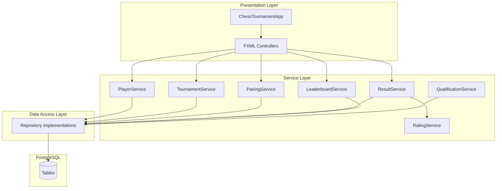
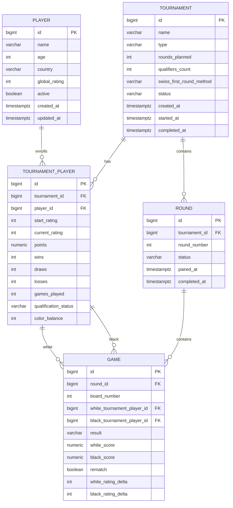

# Software Design Document (SDD)

## Chess Tournament Management System

| Document | Software Design Document |
|----------|--------------------------|
| Version | 1.0 |
| Companion | [SRS.md](./SRS.md) |
| Stack | Java 17, JavaFX 21, Maven, JDBC, PostgreSQL 14+, SLF4J |

---

## Table of Contents

1. [Design Overview](#1-design-overview)
2. [Architecture](#2-architecture)
3. [Project Structure](#3-project-structure)
4. [Database Design](#4-database-design)
5. [Domain Model](#5-domain-model)
6. [Data Access Layer](#6-data-access-layer)
7. [Service Layer](#7-service-layer)
8. [Pairing Algorithms](#8-pairing-algorithms)
9. [Rating Engine](#9-rating-engine)
10. [Leaderboard and Tie-Breaks](#10-leaderboard-and-tie-breaks)
11. [Presentation Layer (JavaFX)](#11-presentation-layer-javafx)
12. [Configuration and Startup](#12-configuration-and-startup)
13. [Transactions and Concurrency](#13-transactions-and-concurrency)
14. [Error Handling](#14-error-handling)
15. [Testing Strategy](#15-testing-strategy)
16. [Build and Run](#16-build-and-run)

---

## 1. Design Overview

### 1.1 Goals

- Enforce **strict layering**: `ui` → `service` → `dao` → `database`.
- Make pairing and rating **pure Java services** testable without DB or UI.
- Use **explicit SQL** in DAO classes (no ORM required for v1).
- Apply **Flyway-style** numbered migrations for schema evolution.

### 1.2 Technology Choices

| Concern | Choice | Rationale |
|---------|--------|-----------|
| JDK | 17 LTS | Stable, wide support |
| JavaFX | 21 (OpenJFX via Maven) | Desktop UI requirement |
| Connection pool | HikariCP | Lightweight, JDBC standard |
| Migrations | Flyway Core | Versioned SQL in repo |
| Logging | SLF4J + Logback | Standard Java logging |
| Tests | JUnit 5, Mockito, Testcontainers (PostgreSQL) | Integration fidelity |

---

## 2. Architecture

### 2.1 Layer Diagram



### 2.2 Dependency Injection (v1)

Manual composition root in `com.chess.tournament.bootstrap.AppContext`:

- Loads config, creates `DataSource`, runs Flyway, instantiates DAOs → services → injects into controllers via constructor/factory.

No Spring for v1 (keeps classpath small).

### 2.3 Key Design Decisions

| ID | Decision |
|----|----------|
| DD-01 | `tournament_player.id` used in `game` FKs (not global `player.id`) |
| DD-02 | Round completion is single transaction updating games, stats, ratings |
| DD-03 | Pairing strategies implement `PairingStrategy` interface per format |
| DD-04 | Swiss first round method stored on `tournament` row |
| DD-05 | Global rating updated on round complete (per SRS) |

---

## 3. Project Structure

```text
Chess_Java/
├── pom.xml
├── README.md
├── config/
│   └── application.properties.example
├── docs/
│   ├── SRS.md
│   └── SDD.md
└── src/
    ├── main/
    │   ├── java/com/chess/tournament/
    │   │   ├── bootstrap/
    │   │   │   ├── ChessTournamentApp.java
    │   │   │   └── AppContext.java
    │   │   ├── config/
    │   │   │   └── DatabaseConfig.java
    │   │   ├── domain/
    │   │   │   ├── Player.java
    │   │   │   ├── Tournament.java
    │   │   │   ├── TournamentPlayer.java
    │   │   │   ├── Round.java
    │   │   │   ├── Game.java
    │   │   │   └── enums/
    │   │   │       ├── TournamentType.java
    │   │   │       ├── TournamentStatus.java
    │   │   │       ├── RoundStatus.java
    │   │   │       ├── GameResult.java
    │   │   │       ├── QualificationStatus.java
    │   │   │       └── SwissFirstRoundMethod.java
    │   │   ├── dao/
    │   │   │   ├── PlayerDao.java
    │   │   │   ├── TournamentDao.java
    │   │   │   ├── TournamentPlayerDao.java
    │   │   │   ├── RoundDao.java
    │   │   │   ├── GameDao.java
    │   │   │   └── impl/...
    │   │   ├── service/
    │   │   │   ├── PlayerService.java
    │   │   │   ├── TournamentService.java
    │   │   │   ├── EnrollmentService.java
    │   │   │   ├── PairingService.java
    │   │   │   ├── ResultService.java
    │   │   │   ├── RatingService.java
    │   │   │   ├── LeaderboardService.java
    │   │   │   ├── QualificationService.java
    │   │   │   └── pairing/
    │   │   │       ├── PairingStrategy.java
    │   │   │       ├── RoundRobinPairingStrategy.java
    │   │   │       ├── KnockoutPairingStrategy.java
    │   │   │       ├── SwissPairingStrategy.java
    │   │   │       └── RoundRobinScheduleGenerator.java
    │   │   ├── exception/
    │   │   │   ├── DomainException.java
    │   │   │   ├── ValidationException.java
    │   │   │   └── NotFoundException.java
    │   │   └── ui/
    │   │       ├── MainController.java
    │   │       ├── player/
    │   │       ├── tournament/
    │   │       └── util/
    │   └── resources/
    │       ├── db/migration/
    │       │   └── V1__initial_schema.sql
    │       ├── fxml/
    │       │   ├── main.fxml
    │       │   └── ...
    │       ├── css/
    │       │   └── app.css
    │       └── logback.xml
    └── test/java/com/chess/tournament/
        ├── service/...
        ├── pairing/...
        └── integration/...
```

---

## 4. Database Design

### 4.1 ER Diagram



### 4.2 DDL (V1__initial_schema.sql)

Implement exactly:

```sql
CREATE TABLE player (
    id              BIGSERIAL PRIMARY KEY,
    name            VARCHAR(200) NOT NULL,
    age             INTEGER CHECK (age IS NULL OR age >= 0),
    country         VARCHAR(100),
    global_rating   INTEGER NOT NULL DEFAULT 1500,
    active          BOOLEAN NOT NULL DEFAULT TRUE,
    created_at      TIMESTAMPTZ NOT NULL DEFAULT NOW(),
    updated_at      TIMESTAMPTZ NOT NULL DEFAULT NOW()
);

CREATE TABLE tournament (
    id                        BIGSERIAL PRIMARY KEY,
    name                      VARCHAR(200) NOT NULL,
    type                      VARCHAR(32) NOT NULL CHECK (type IN ('ROUND_ROBIN','KNOCKOUT','SWISS')),
    rounds_planned            INTEGER NOT NULL CHECK (rounds_planned >= 1),
    qualifiers_count          INTEGER NOT NULL CHECK (qualifiers_count >= 0),
    swiss_first_round_method  VARCHAR(32) DEFAULT 'RANDOM'
        CHECK (swiss_first_round_method IN ('RANDOM','RATING_SPLIT')),
    status                    VARCHAR(32) NOT NULL DEFAULT 'DRAFT'
        CHECK (status IN ('DRAFT','ACTIVE','COMPLETED','CANCELLED')),
    created_at                TIMESTAMPTZ NOT NULL DEFAULT NOW(),
    started_at                TIMESTAMPTZ,
    completed_at              TIMESTAMPTZ
);

CREATE TABLE tournament_player (
    id                    BIGSERIAL PRIMARY KEY,
    tournament_id         BIGINT NOT NULL REFERENCES tournament(id),
    player_id             BIGINT NOT NULL REFERENCES player(id),
    start_rating          INTEGER NOT NULL,
    current_rating        INTEGER NOT NULL,
    points                NUMERIC(5,1) NOT NULL DEFAULT 0,
    wins                  INTEGER NOT NULL DEFAULT 0,
    draws                 INTEGER NOT NULL DEFAULT 0,
    losses                INTEGER NOT NULL DEFAULT 0,
    games_played          INTEGER NOT NULL DEFAULT 0,
    qualification_status  VARCHAR(32) NOT NULL DEFAULT 'PENDING'
        CHECK (qualification_status IN ('PENDING','QUALIFIED','ELIMINATED','NOT_APPLICABLE')),
    color_balance         INTEGER NOT NULL DEFAULT 0,
    UNIQUE (tournament_id, player_id)
);

CREATE TABLE round (
    id              BIGSERIAL PRIMARY KEY,
    tournament_id   BIGINT NOT NULL REFERENCES tournament(id),
    round_number    INTEGER NOT NULL CHECK (round_number >= 1),
    status          VARCHAR(32) NOT NULL DEFAULT 'PENDING_PAIRINGS'
        CHECK (status IN ('PENDING_PAIRINGS','PAIRINGS_PUBLISHED','IN_PROGRESS','COMPLETED')),
    paired_at       TIMESTAMPTZ,
    completed_at    TIMESTAMPTZ,
    UNIQUE (tournament_id, round_number)
);

CREATE TABLE game (
    id                          BIGSERIAL PRIMARY KEY,
    round_id                    BIGINT NOT NULL REFERENCES round(id) ON DELETE CASCADE,
    board_number                INTEGER NOT NULL,
    white_tournament_player_id  BIGINT REFERENCES tournament_player(id),
    black_tournament_player_id  BIGINT REFERENCES tournament_player(id),
    result                      VARCHAR(32) CHECK (result IN ('WHITE_WIN','BLACK_WIN','DRAW','BYE','PENDING')),
    white_score                 NUMERIC(3,1),
    black_score                 NUMERIC(3,1),
    rematch                     BOOLEAN NOT NULL DEFAULT FALSE,
    white_rating_delta          INTEGER,
    black_rating_delta          INTEGER,
    UNIQUE (round_id, board_number)
);

CREATE INDEX idx_tp_tournament ON tournament_player(tournament_id);
CREATE INDEX idx_round_tournament ON round(tournament_id);
CREATE INDEX idx_game_round ON game(round_id);
```

### 4.3 Migration Policy

- All schema changes via new `V{n}__description.sql`.
- Never edit applied migrations in shared environments.

---

## 5. Domain Model

### 5.1 Enums

```java
public enum TournamentType { ROUND_ROBIN, KNOCKOUT, SWISS }
public enum TournamentStatus { DRAFT, ACTIVE, COMPLETED, CANCELLED }
public enum RoundStatus { PENDING_PAIRINGS, PAIRINGS_PUBLISHED, IN_PROGRESS, COMPLETED }
public enum GameResult { PENDING, WHITE_WIN, BLACK_WIN, DRAW, BYE }
public enum QualificationStatus { PENDING, QUALIFIED, ELIMINATED, NOT_APPLICABLE }
public enum SwissFirstRoundMethod { RANDOM, RATING_SPLIT }
```

### 5.2 Value Objects

**PairingProposal**: `boardNumber`, `whiteTpId`, `blackTpId` (nullable), `bye` flag.

**StandingRow**: `rank`, `tournamentPlayerId`, `playerName`, `rating`, `points`, W/D/L.

**RatingOutcome**: `newRating`, `delta`.

### 5.3 Invariants (enforce in services)

- Game cannot have same white and black TP id.
- At most one bye per round per Swiss/Round Robin round.
- Knockout game must have two players unless bye.

---

## 6. Data Access Layer

### 6.1 Patterns

- One DAO interface + `Jdbc*Dao` implementation per aggregate root table.
- Use `Connection` from pool; callers pass connection for transactional methods or use `UnitOfWork` helper.

### 6.2 UnitOfWork

```java
public interface UnitOfWork {
    <T> T executeInTransaction(TransactionCallback<T> callback);
}
```

Implementation sets `autoCommit=false`, commit on success, rollback on any exception.

### 6.3 Repository Method Catalog (minimum)

**PlayerDao**

- `long insert(Player p)`
- `Optional<Player> findById(long id)`
- `List<Player> findAll(boolean activeOnly)`
- `void update(Player p)`

**TournamentDao**

- `long insert(Tournament t)`
- `Optional<Tournament> findById(long id)`
- `List<Tournament> findByStatus(TournamentStatus status)`
- `void updateStatus(long id, TournamentStatus status, Instant startedAt, Instant completedAt)`

**TournamentPlayerDao**

- `long insert(TournamentPlayer tp)`
- `List<TournamentPlayer> findByTournament(long tournamentId)`
- `void updateStats(TournamentPlayer tp)`
- `void updateQualification(long tpId, QualificationStatus status)`
- `void deleteByTournamentAndPlayer(long tournamentId, long playerId)`

**RoundDao**

- `long insert(Round r)`
- `Optional<Round> findByTournamentAndNumber(long tournamentId, int roundNumber)`
- `List<Round> findByTournament(long tournamentId)`
- `void updateStatus(long roundId, RoundStatus status, Instant pairedAt, Instant completedAt)`

**GameDao**

- `void insertBatch(List<Game> games)`
- `List<Game> findByRound(long roundId)`
- `void updateResult(Game game)`
- `Set<LongPair> findPreviousPairings(long tournamentId)` — returns unordered pairs of TP ids

---

## 7. Service Layer

### 7.1 PlayerService

- Validates name non-blank.
- Default rating 1500.
- `create`, `update`, `list`.

### 7.2 TournamentService

- `createTournament(CreateTournamentCommand cmd)` — validates type-specific rounds (delegates to validators).
- `startTournament(long tournamentId)` — sets ACTIVE, creates round 1 row PENDING_PAIRINGS.
- `finalizeTournament(long tournamentId)` — COMPLETED, triggers qualification.

**Validators**

- `RoundRobinValidator`: rounds == N or N-1 per schedule generator output.
- `KnockoutValidator`: rounds == bracket depth.
- `SwissValidator`: rounds_planned >= 1.

### 7.3 EnrollmentService

- `enroll(long tournamentId, long playerId)` — copy global_rating to start/current.
- `unenroll` — only if no games exist for tournament.
- `lock check`: if any round has status != PENDING_PAIRINGS for round 1, deny enroll.

### 7.4 PairingService

```java
public interface PairingService {
    List<PairingProposal> generatePairings(long tournamentId, int roundNumber);
    void publishPairings(long tournamentId, int roundNumber, List<PairingProposal> proposals);
}
```

Flow:

1. Load tournament, round, enrolled players, prior games.
2. Select strategy from `PairingStrategyFactory`.
3. Validate proposals (unique players, bye rules).
4. `publishPairings`: insert games, set round PAIRINGS_PUBLISHED, tournament round IN_PROGRESS if first game.

### 7.5 ResultService

- `saveGameResult(long gameId, GameResult result)` — optional incremental save.
- `completeRound(long tournamentId, int roundNumber)`:
  1. Assert all games have results.
  2. For each game: apply scores to TP aggregates.
  3. Call `RatingService.applyRoundRatings`.
  4. Update round COMPLETED.
  5. Knockout: mark losers ELIMINATED.

### 7.6 RatingService

See [Section 9](#9-rating-engine).

### 7.7 LeaderboardService

- `getLeaderboard(long tournamentId, Integer upToRound)` — compute from TP if after latest completed round.

### 7.8 QualificationService

- `applyQualification(long tournamentId)` — sort standings, top Q → QUALIFIED, rest ELIMINATED (respect existing ELIMINATED in KO).

---

## 8. Pairing Algorithms

### 8.1 Strategy Interface

```java
public interface PairingStrategy {
    boolean supports(TournamentType type);
    List<PairingProposal> pair(PairingContext ctx);
}

public record PairingContext(
    Tournament tournament,
    int roundNumber,
    List<TournamentPlayer> players,
    Set<LongPair> previousPairings,
    List<Game> currentRoundGames // empty when generating
) {}
```

### 8.2 Round Robin — Circle Method

**Schedule generation** (offline, once at start optional):

- Fix player list order by enrollment id.
- If odd N, append phantom BYE slot (not a player) — implementation uses bye TP rotation instead: rotate list, pair 1 vs N, 2 vs N-1, ...

Algorithm for round `r` (1-based):

1. Fix index 0; rotate indices `1..N-1` clockwise `(r-1)` times.
2. Pair `i` with `N-1-i` for `i in 0..N/2-1`.
3. If odd, unpaired index gets bye (real player with no opponent).

Persist full schedule in memory from `RoundRobinScheduleGenerator.generate(N, playerIds)`.

### 8.3 Knockout

**Round 1**:

1. Sort players by rating desc (stable).
2. Let `B = nextPowerOfTwo(N)`, byes = B - N.
3. Top `(N - byes)` players paired in rating order 1v2, 3v4, ... — **alternate**: standard seeding 1 vs B, 2 vs B-1 (implement 1 vs lowest seed for clarity in SDD): use bracket seeding `[1 vs 8, 4 vs 5, 3 vs 6, 2 vs 7]` for 8 players.

**Byes**: lowest rated `byes` players receive bye games (auto WIN vs null).

**Round r>1**:

- Winners from previous round paired in bracket order (game list order: pair game 1 winner vs game 2 winner, etc.).

### 8.4 Swiss — Round 1

**RANDOM**: shuffle TP list with `Collections.shuffle(list, new Random(tournamentId))` for reproducibility optional seed from tournament id.

**RATING_SPLIT**: sort by rating desc; split half; pair 1 vs (N/2+1), 2 vs (N/2+2), ...

Handle odd: last unpaired gets bye.

### 8.5 Swiss — Round r>1 (Simplified Dutch)

1. Sort players by points desc, rating desc.
2. Partition into score groups (equal points).
3. For each group (largest first):
   - Sort by rating desc within group.
   - Split into upper and lower half.
   - Greedy pair upper[i] with lower[i], scanning for first lower[j] such that pair not in `previousPairings`.
   - Track color: assign white to player with lower color_balance (needs white); else higher rating gets white.
4. If odd group count across tournament, one bye to lowest-rated player in lowest score group without bye history (prefer never had bye).

5. If rematch unavoidable, set `rematch=true`.

**Validation**: no player in two games; board numbers sequential from 1.

---

## 9. Rating Engine

### 9.1 Interface

```java
public final class RatingService {
    private static final int K = 32;

    public RatingOutcome rate(int playerRating, int opponentRating, double actualScore) {
        double expected = 1.0 / (1.0 + Math.pow(10, (opponentRating - playerRating) / 400.0));
        int delta = (int) Math.round(K * (actualScore - expected));
        return new RatingOutcome(playerRating + delta, delta);
    }
}
```

### 9.2 Round Application Order

For each game in round (non-bye):

1. Read white and black **current_rating** (snapshot at round start — load all TP at begin of transaction).
2. Compute deltas; write to game row; update TP current_rating and global player rating.

Use same starting ratings for all games within the round (SRS BR-RAT-003).

---

## 10. Leaderboard and Tie-Breaks

### 10.1 Sort Comparator

Implement `StandingComparator`:

1. `points` DESC
2. If tie size 2: head-to-head points from games between the two
3. `current_rating` DESC
4. `playerName` ASC

### 10.2 Head-to-Head Helper

Query games where both TP ids in tied set; sum points from those games only.

---

## 11. Presentation Layer (JavaFX)

### 11.1 Navigation

`MainController` hosts `BorderPane` center content loader. Menu:

- Players
- Tournaments
- Settings (DB test button)

### 11.2 FXML ↔ Controller Binding

| FXML | Controller | Services |
|------|--------------|----------|
| `player_list.fxml` | `PlayerListController` | PlayerService |
| `tournament_list.fxml` | `TournamentListController` | TournamentService |
| `tournament_dashboard.fxml` | `TournamentDashboardController` | Multiple |
| `pairings.fxml` | `PairingsController` | PairingService |
| `results.fxml` | `ResultsController` | ResultService |
| `leaderboard.fxml` | `LeaderboardController` | LeaderboardService |

### 11.3 State-Driven UI Enablement

`TournamentViewModel` (plain Java, no FX bindings required) exposes:

- `canEnroll`, `canGeneratePairings`, `canEnterResults`, `canCompleteRound`, `canFinalize`

Computed from tournament status + round statuses.

### 11.4 Threading

- DB calls off JavaFX thread using `Task<T>` or virtual threads (Java 21) with `Platform.runLater` for UI updates.
- Show progress indicator on long pairing.

---

## 12. Configuration and Startup

### 12.1 DatabaseConfig

Load from env then properties file:

```properties
db.url=jdbc:postgresql://localhost:5432/chess_tournament
db.user=ctms
db.password=changeme
db.pool.size=5
```

### 12.2 Startup Sequence

1. Load config
2. HikariDataSource
3. Flyway.migrate()
4. AppContext wiring
5. Load main.fxml

---

## 13. Transactions and Concurrency

- **completeRound**: single transaction.
- **publishPairings**: single transaction (games + round status).
- Application single-user; isolation level READ COMMITTED default sufficient.

---

## 14. Error Handling

| Layer | Approach |
|-------|----------|
| DAO | Wrap SQLException in `DataAccessException` |
| Service | Throw `ValidationException` with field errors |
| UI | Catch `DomainException`, show Alert |

Never expose SQL to user.

---

## 15. Testing Strategy

| Level | Scope |
|-------|--------|
| Unit | RatingService, StandingComparator, RoundRobinScheduleGenerator, SwissPairingStrategy (mock context) |
| Integration | ResultService.completeRound with Testcontainers PostgreSQL |
| UI | Optional TestFX smoke; manual E2E checklist in Phase 10 |

---

## 16. Build and Run

### 16.1 Maven Coordinates

```xml
<groupId>com.chess.tournament</groupId>
<artifactId>chess-tournament-manager</artifactId>
<version>1.0.0-SNAPSHOT</version>
```

### 16.2 Plugins

- `maven-compiler-plugin` release 17
- `javafx-maven-plugin` mainClass `com.chess.tournament.bootstrap.ChessTournamentApp`
- `flyway-maven-plugin` for CI migrate

### 16.3 Commands

```bash
# Create DB
createdb chess_tournament

# Migrate
mvn flyway:migrate

# Run
mvn javafx:run

# Test
mvn test
```

---

*End of SDD v1.0*
